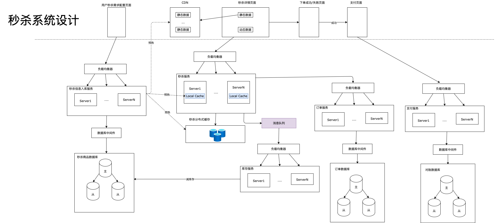

# 秒杀系统设计

## 设计目标
* 高可用
* 高性能
* 瞬间高并发
* 可扩展

## 架构设计

### 高可用
* 通过独立部署相关的服务，降低对其他业务服务的影响，以及其他服务对秒杀业务的影响
* 通过多台服务器 + 负载均衡器提高服务的可用性，可扩展性，高性能，分担单台服务器的压力
* 数据存储层通过主备来提高可用性和读的性能

### 高性能与瞬间高并发的支持
* 动静分离  
将秒杀详情页面里静态数据预热放在CDN缓存里，减少对服务器端不必要的数据请求及网络压力，加快速度

* 对数据库瞬间并发进行保护
    * **分层过滤**
1）前端过滤掉不需要动态数据的请求  
2）每个服务器里维护Local缓存，过滤掉超过本地商品库存量的请求 （最终的数据一致性在数据库层进行保障）    
3）全局的秒杀分布式缓存过滤掉从每个服务器过来的已经超过缓存里商品库存量的请求  
4）真正进入到数据库层面的请求相对来说已经比较少了，到订单和支付层面的就更少了  

    * **异步处理进行削峰** 
1）通过在秒杀服务和库存服务之间通过异步消息队列的方式，进行削峰，防止对数据库大量的请求  
2）对数据库操作成功后再通知秒杀服务结果  

    * **限流，排除与拒绝服务** 
1）可以在前端控制用户点击秒杀按钮的时间间隔，或者控制同一个用户同一个IP发送请求的频率  
2）在负载均衡器这端可以控制进入的流量，超过一定的流量直接拒绝  
3）秒杀服务内部也可以在超过一定的请求量以后进行排队，或者服务器CPU到达阈值后直接丢弃、拒绝请求  

### 可扩展
微服务部署根据流量自动增加或者减少机器  

